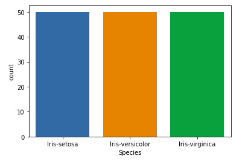
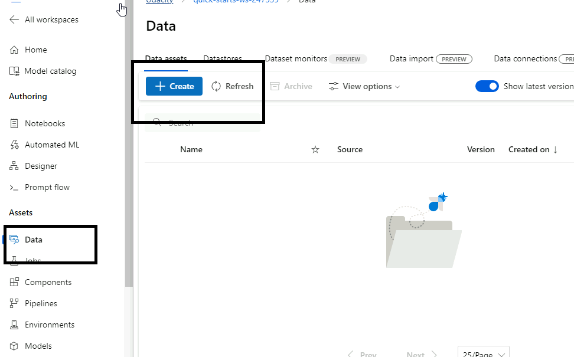
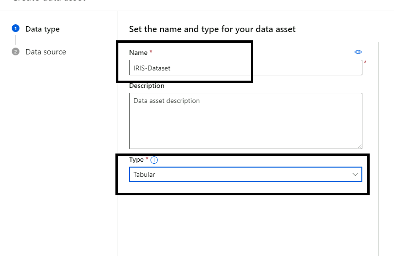
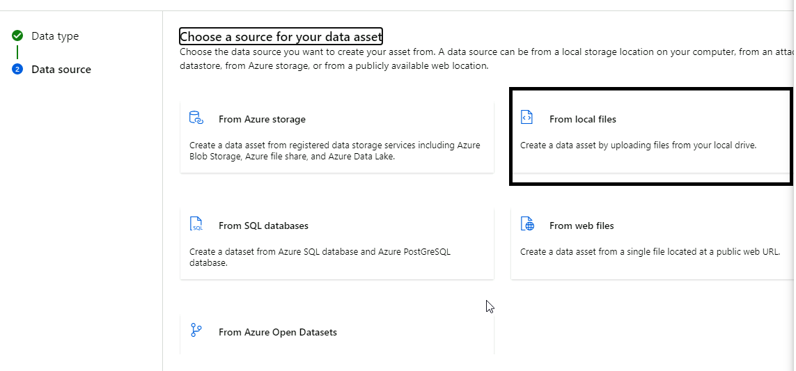
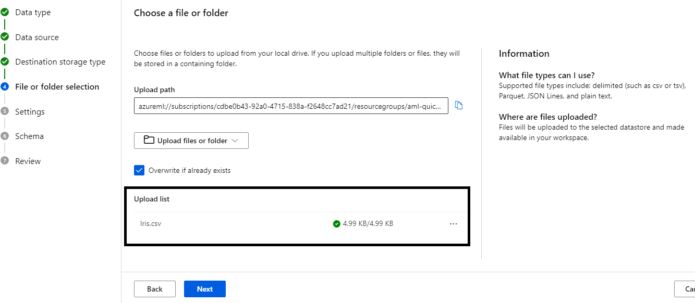
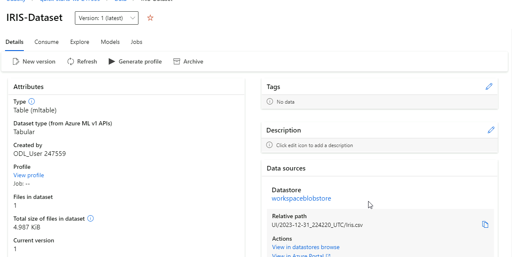
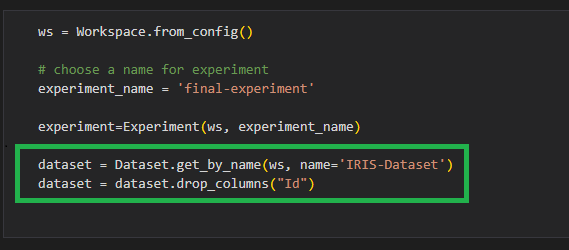

# Capstone project
In this project I create, train, deploy and consume 1 type of model: AutoML and HypderDrive to compare and choose the best model to use. The dataset I used is the Iris Species, which aims to classifiy flower using their SepalLength, SepalWidth, PetalLength, PetalWidth.

The project is the best practice of using servies in Azure Machine learing Studio: AutoML and HyperDrive to train and deploy it as a Cloud Web Services. Perform steps like train, deploy,... by code is crucial, because it help to automate the work.


## Dataset

### Overview

I use the IRIS PIECES dataset downdloaded from Kaggle. The data contain the size of the flower and the label is the spieces of them.  Iris is a flowering plant, the researchers have measured various features of the different iris flowers and recorded them digitally.

Iris dataset is a small dataset with about 150 records of iris flowers with the label of piece of that record. This is a balance data set where each lable has the same number of record (50).



This is a multiple classes classification problem with 3 categories and 4 proberties.

#### Preprocessing
This is a well processing dataset, no need to  perform to much processing. I just:
1. Remove the Id colunm since it's meanless when recognize the flower piece.
2. Transform lable to numeric value so that we can fit into the machien learning model.

### Task

Task of the dataset is to predict the PIECES of flower "Iris-setosa", "Iris-versicolor", "Iris-virginica". There are 4 features:
1. SepalLengthCm
2. SepalWidthCm
3. PetalLengthCm
4. PetalWidthCm. 

These are the size of the Sepal and Petal of the flowers, all of them are numeric.


### Access

To access the data:
1. I fristly import it to workspace datasets.

2. Choose the type of dataset

3. I use option "from local file". 

4. Then I upload the csv file, which was download from Kaggle, to azure. 

5. Finally I click "Create" button to create my dataset with name "IRIS-Dataset"


To load data to train, I use `Dataset.get_by_name(ws, dataset_name)` method.



## Automated ML
These are the setting for Automated ML model:

* **The task:** "Classfification"
    + This is mandatory, because the target is to find the category of the iris flower. It has to be "classficaition" for the task.

* The metric: "accuracy":
    + 'accuracy' is one of the metrics for classfification. We also choose another like AUC, AUC Weighted,...

* experiment_timeout_minutes: 20
    + This indicate the maximum total time of the experiment, over this time, the experiment stop. I choose just 20, because I think the dataset here small and ease to get the well-performed model shortly. We can extends this expitation longer.
* max_concurrent_iterations: 5
    + This is how many model are trained at the same time. The more concurrent iterations, the fast the experiment we train.
* label_column_name:
    * This show to the SDK that which column are the target of training. And this case, it obviously the "Spieces" label.

### Results

I don't see many parameters to change and try in the AutoML, it do almost thing for us. But I can increase the timeout have find more solution to choose. Beside, I can consider to include/exclude when run automl.

_

## Hyperparameter Tuning

I choose the Linear SVC because:
* It supports multible classes classfication task, which is the problem we working in.
* It requires numerice data, and all of features of the dataset is number.

The parameters to be use:
* C: 
* max_iter: 

### Results
The result is extremly good with this dataset, nearly 100% (it can also because this is a small and balance dataset)!
The parameter I turn are:
    + C: Uniform(0.01, 1)
    + max-iter: Choice(values=[50, 100, 200])
with used the Random Sampling method. There many parameter we can try: penalty, loos type,... to improve performace.


**I used the SDK v2 for this experiment, my experiment return the SweepJob object, which does not support RunDetails. It doesn't show anything**


## Model Deployment
The step of deploy the model is deatils in code.
* Step 1: Get the best model
```
best_run, fitted_model = remote_run.get_output()
```

* Step 2: Download model fiels to local
```
best_run.download_files(output_directory=DEPLOY_DIR) #this code help to download files of the 
```

* Step 3: Create and register model
```
from azure.ai.ml.constants import AssetTypes
model_path = os.path.join(DEPLOY_DIR, "model.pkl")
model = Model(
    name="thaihocmodel",
    path=model_path,
    type=AssetTypes.CUSTOM_MODEL,
    description="The best model from AutoML"
)
model = ML_CLIENT.models.create_or_update(model) #model now is registered with the workspace
```

* Step 4: Create and register the endpoint

```
from azure.ai.ml.entities import ManagedOnlineEndpoint
import datetime
endpoint_name = f"automl-{datetime.datetime.now().strftime('%m%d%H%M%f')}"
ENDPOINT = ManagedOnlineEndpoint(
    name=endpoint_name
)
# Register the end point
ML_CLIENT.begin_create_or_update(ENDPOINT)
```

* Step 5: Create the deployment
```
from azure.ai.ml.entities import ManagedOnlineDeployment, CodeConfiguration
deployment_name = "auto-deploy-15"

environment = Environment(image="mcr.microsoft.com/azureml/curated/responsibleai-ubuntu20.04-py38-cpu:38")
env = Environment(
    conda_file=os.path.join(DEPLOY_DIR, "conda_env_v_1_0_0.yml"),
    image="mcr.microsoft.com/azureml/openmpi3.1.2-ubuntu18.04:latest",
)
DEPLOYMENT = ManagedOnlineDeployment(
    name=deployment_name,
    environment = env,
    endpoint_name=endpoint_name,
    model=model,
    code_configuration=CodeConfiguration(
        code=DEPLOY_DIR, 
        scoring_script="scoring_file_v_2_0_0.py"
    ),
    instance_count=1,
    instance_type="Standard_DS3_v2"
)

```
* Step 6: Submit the deployment
```
ML_CLIENT.begin_create_or_update(DEPLOYMENT)
```

The model to choose is from Hyperparameter turned model. The accuracy metric is 1, the deatils result is in the image below

The values of `C` and `max_iter` is: `hyperparameters : {"C": 0.8386103335068411, "max_iter": 100}`

## Future Improvements
For furthe improvement:
* I should learn more and the SDK
* Create a Pipeline for automation is a good idea
* Or I can create a simple web page to demostrate the endpoint consumsion.

## Screen Recording

[Screen cast](https://youtu.be/C8zufe5FGNs)

## Deploying the Model

I would like to add this section to help reviewers to convinient when check the **Deploying the Model** in the rubric.
    1. Model registered
        a. AutoML
            
        b. Hyperdrive
            
    2. Model deployed: the best parameter turning model
        
    3. A file containing the environment details: the file `./conda_dependencies.yml`