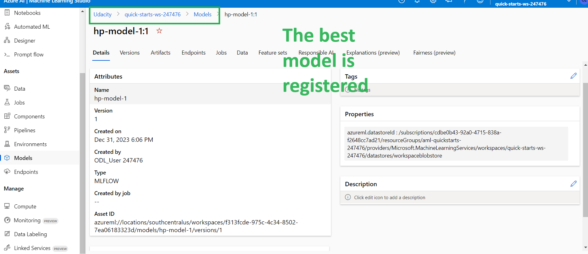

*NOTE:* This file is a template that you can use to create the README for your project. The *TODO* comments below will highlight the information you should be sure to include.

# Your Project Title Here

*TODO:* Write a short introduction to your project.
In this project I create, train, deploy and consume 1 type of model: AutoML and HypderDrive to compare and choose the best model to use. The dataset I used is the Iris Species, which aims to classifiy flower using their SepalLength, SepalWidth, PetalLength, PetalWidth.

## Project Set Up and Installation
*OPTIONAL:* If your project has any special installation steps, this is where you should put it. To turn this project into a professional portfolio project, you are encouraged to explain how to set up this project in AzureML.

## Dataset

### Overview
*TODO*: Explain about the data you are using and where you got it from.
I use the IRIS PIECES dataset. The data contain the size of the flower and the label is the spieces of them. This is a multiple classes classification problem with 3 categories and 4 proberties. I get this dataset from Kaggle.

### Task
*TODO*: Explain the task you are going to be solving with this dataset and the features you will be using for it.
Task of the dataset is to predict the PIECES of flower "Iris-setosa", "Iris-versicolor", "Iris-virginica". There are 4 features:
SepalLengthCm, SepalWidthCm, PetalLengthCm, PetalWidthCm. These are the size of the Sepal and Petal of the flowers, all of them are numeric.

### Access
*TODO*: Explain how you are accessing the data in your workspace.
To access the data, I fristly import it to workspace datasets. I use option "from local file". Then I upload the csv file, which was download from Kaggle, to azure. Finally I click "Create" button to create my dataset with name "IRIS-Dataset"
To load data to train, I use `Dataset.get_by_name(ws, dataset_name)` method.

## Automated ML
*TODO*: Give an overview of the `automl` settings and configuration you used for this experiment
The task of automl is "Classfification" and the metric I choose is "AUC_weighted". I aslo setting time out is 20 and max concurrent iterations to 5.

### Results
*TODO*: What are the results you got with your automated ML model? What were the parameters of the model? How could you have improved it?
I don't see many parameters to change and try in the AutoML, it do almost thing for us. But I can increase the timeout have find more solution to choose. Beside, I can consider to include/exclude when run automl.
*TODO* Remeber to provide screenshots of the `RunDetails` widget as well as a screenshot of the best model trained with it's parameters.

## Hyperparameter Tuning
*TODO*: What kind of model did you choose for this experiment and why? Give an overview of the types of parameters and their ranges used for the hyperparameter search
I choose the Linear SVM because it is used for multible classes classfication task, suitable with numeric data, and ovioustly it is one of roboust algorithms.

### Results
*TODO*: What are the results you got with your model? What were the parameters of the model? How could you have improved it?
The result is extremly good with this dataset, nearly 100% (it can also because this is a small and balance dataset)!
The parameter I turn are:
    + C: Uniform(0.01, 1)
    + max-iter: Choice(values=[50, 100, 200])
with used the Random Sampling method. There many parameter we can try: penalty, loos type,,... to improve performace.

*TODO* Remeber to provide screenshots of the `RunDetails` widget as well as a screenshot of the best model trained with it's parameters.
**I used the SDK v2 for this experiment, my experiment return the SweepJob object, which does not support RunDetails. It doesn't show anything**

## Model Deployment
*TODO*: Give an overview of the deployed model and instructions on how to query the endpoint with a sample input.
The model to choose is from Hyperparameter turned model. The accuracy metric is 1, the deatils result is in the image below

The values of `C` and `max_iter` is: `hyperparameters : {"C": 0.8386103335068411, "max_iter": 100}`

## Screen Recording
*TODO* Provide a link to a screen recording of the project in action. Remember that the screencast should demonstrate:
[Screen cast](https://youtu.be/C8zufe5FGNs)
## Deploying the Model
I would like to add this section to help reviewers to convinient when check the **Deploying the Model** in the rubric.
    1. Model registered
        a. AutoML
            
        b. Hyperdrive
            
    2. Model deployed: the best parameter turning model
        
    3. A file containing the environment details: the file `./conda_dependencies.yml`

## Standout Suggestions
*TODO (Optional):* This is where you can provide information about any standout suggestions that you have attempted.
